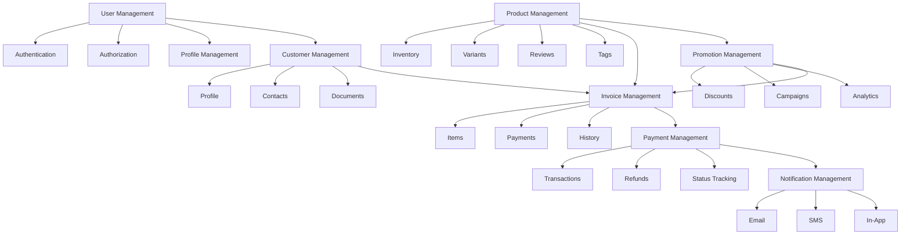
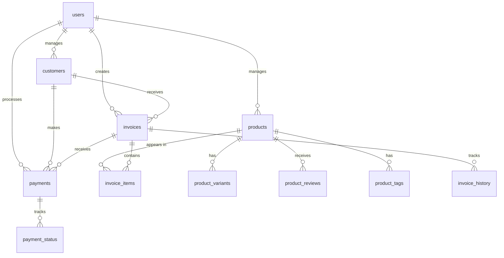

# Backend System Documentation

## Overview
This documentation covers the backend system architecture and its various modules. The system is built using Node.js, Express, and PostgreSQL, following a modular architecture for better maintainability and scalability.

## System Architecture



## Module Documentation

### Core Modules

1. [User Management](user-management.md)
   - User authentication and authorization
   - Profile management
   - Role-based access control
   - Session management

2. [Product Management](product-management.md)
   - Product catalog
   - Inventory management
   - Product variants
   - Reviews and ratings
   - Tags and categories

3. [Customer Management](customer-management.md)
   - Customer profiles
   - Contact management
   - Document management
   - Customer history

4. [Invoice Management](invoice-management.md)
   - Invoice generation
   - Item management
   - Status tracking
   - History logging

5. [Payment Management](payment-management.md)
   - Payment processing
   - Transaction tracking
   - Refund management
   - Payment status

6. [Notification Management](notification-management.md)
   - Email notifications
   - SMS notifications
   - In-app notifications
   - Template management

7. [Promotion Management](promotion-management.md)
   - Discount management
   - Campaign management
   - Usage tracking
   - Performance analytics

## Database Schema



## API Structure

### Base URL
```
https://api.example.com/v1
```

### Authentication
- JWT-based authentication
- Token expiration: 24 hours
- Refresh token mechanism

### Common Headers
```http
Authorization: Bearer <token>
Content-Type: application/json
Accept: application/json
```

### Response Format
```json
{
  "status": "success",
  "data": {},
  "message": "Operation successful",
  "meta": {
    "page": 1,
    "limit": 10,
    "total": 100
  }
}
```

## Development Setup

### Prerequisites
- Node.js (v14 or higher)
- PostgreSQL (v12 or higher)
- Redis (for caching)
- NPM or Yarn

### Installation
1. Clone the repository
2. Install dependencies:
   ```bash
   npm install
   ```
3. Set up environment variables:
   ```bash
   cp .env.example .env
   ```
4. Run migrations:
   ```bash
   npm run migrate
   ```
5. Start the server:
   ```bash
   npm start
   ```

### Development Commands
- `npm start` - Start the server
- `npm run dev` - Start in development mode
- `npm test` - Run tests
- `npm run lint` - Run linter
- `npm run migrate` - Run migrations
- `npm run seed` - Seed the database

## Testing

### Test Structure
- Unit tests
- Integration tests
- API tests
- Performance tests

### Running Tests
```bash
# All tests
npm test

# Specific test file
npm test -- tests/user.test.js

# With coverage
npm run test:coverage
```

## Deployment

### Environment Variables
- `NODE_ENV` - Environment (development, production)
- `PORT` - Server port
- `DATABASE_URL` - Database connection string
- `JWT_SECRET` - JWT secret key
- `REDIS_URL` - Redis connection string

### Deployment Steps
1. Build the application
2. Set up environment variables
3. Run database migrations
4. Start the server
5. Configure reverse proxy
6. Set up SSL

## Monitoring

### Logging
- Application logs
- Error logs
- Access logs
- Performance logs

### Metrics
- Response times
- Error rates
- Database performance
- Memory usage

### Alerts
- Error notifications
- Performance alerts
- Security alerts
- Resource usage alerts

## Security

### Authentication
- JWT-based authentication
- Password hashing
- Session management
- Rate limiting

### Authorization
- Role-based access control
- Permission management
- Resource ownership
- API key management

### Data Protection
- Data encryption
- Secure storage
- Input validation
- XSS protection

## Contributing

### Code Style
- Follow ESLint rules
- Use Prettier for formatting
- Follow naming conventions
- Write meaningful comments

### Git Workflow
1. Create feature branch
2. Make changes
3. Run tests
4. Create pull request
5. Code review
6. Merge to main

### Documentation
- Update relevant documentation
- Add comments for complex logic
- Document API changes
- Update README if needed

## Support

### Getting Help
- Check documentation
- Search issues
- Create new issue
- Contact support team

### Reporting Issues
- Use issue template
- Provide reproduction steps
- Include error logs
- Add screenshots if needed

## License
This project is licensed under the MIT License - see the [LICENSE](LICENSE) file for details. 